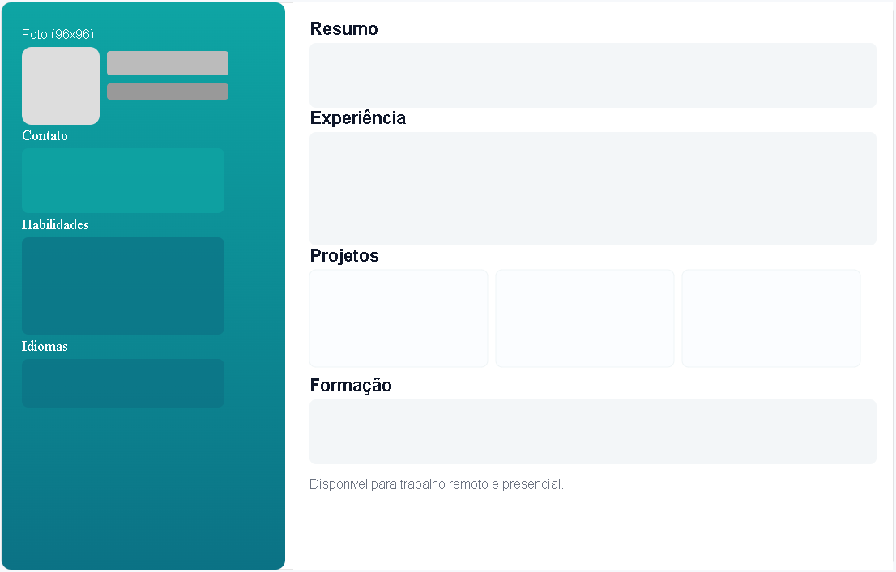

# Tutorial: Criando um Currículo Online com HTML, CSS, SEO e Publicação no GitHub Pages

Este tutorial ensina como criar um currículo online responsivo e acessível usando HTML, CSS, boas práticas de SEO e publicá-lo no GitHub Pages. Vamos passo a passo, desde a estrutura básica do HTML até a publicação final.

## Wireframe do Currículo Online



## Passo 1 – Estrutura Básica do HTML

Todo documento HTML começa com uma estrutura básica. Essa estrutura define a linguagem, o título e os metadados.

```html
<!doctype html>
<html lang="pt-BR">
<head>
  <meta charset="utf-8">
  <meta name="viewport" content="width=device-width, initial-scale=1">
  <title>Fabricio Bizotto — Currículo</title>
  <meta name="description" content="Currículo de Fabricio Bizotto — Desenvolvedor(a) Front-end. Contato, habilidades, experiência e projetos.">
  <meta name="author" content="Fabricio Bizotto">
  <!-- favicon -->
  <link rel="icon" href="https://avatars.githubusercontent.com/u/28762356?v=4&size=64" type="image/png">
</head>
<body>
  <!-- Conteúdo do currículo aqui -->
</body>
</html>
```

**Explicação:**

* `<!doctype html>`: informa que o documento é HTML5.
* `<html lang="pt-BR">`: define o idioma da página como português do Brasil.
* `<meta charset="utf-8">`: configura a codificação de caracteres para UTF-8.
* `<meta name="viewport">`: torna a página responsiva em dispositivos móveis.
* `<title>`: título que aparece na aba do navegador.
* `<meta name="description">` e `<meta name="author">`: informações importantes para SEO e organização.

---

## Passo 2 – Adicionando Open Graph e Robots para SEO

Para melhorar o compartilhamento em redes sociais e a indexação por buscadores, adicionamos essas tags dentro do `<head>`:

```html
<!-- Open Graph para redes sociais -->
<meta property="og:title" content="Fabricio Bizotto - Currículo Online" />
<meta property="og:description" content="Currículo profissional de Desenvolvedor Front-end, com experiência, habilidades e projetos." />
<meta property="og:type" content="website" />
<meta property="og:url" content="https://fabricioifc.github.io/seurepositorio/" />
<meta property="og:image" content="https://avatars.githubusercontent.com/u/28762356?v=4&size=64" />

<!-- Robots para motores de busca -->
<meta name="robots" content="index, follow" />
```

---

## Passo 3 – Importando Fontes e Ícones Externos

Para usar uma fonte agradável e ícones (GitHub, LinkedIn), inclua no `<head>`:

```html
<!-- Fonte do Google Fonts -->
<link href="https://fonts.googleapis.com/css2?family=Inter:wght@300;400;600;700&display=swap" rel="stylesheet">

<!-- Font Awesome para ícones -->
<link rel="stylesheet" href="https://cdnjs.cloudflare.com/ajax/libs/font-awesome/7.0.0/css/all.min.css" />
```

---

## Passo 4 – Estilos Básicos com CSS

No `<head>`, adicione a tag `<style>` para os estilos da página. Exemplo:

```css
:root {
  --bg: #f6f8fb;
  --card: #ffffff;
  --muted: #6b7280;
  --accent: #0ea5a4;
  --accent-2: #0b7285;
  --text: #0f172a;
  --gap: 1rem;
}

* {
  box-sizing: border-box;
  margin: 0;
  padding: 0;
}

body {
  font-family: Inter, system-ui, sans-serif;
  background: var(--bg);
  color: var(--text);
  padding: 1rem;
  display: flex;
  justify-content: center;
}
```

**Dica:** Variáveis CSS (`--bg`, `--accent`) facilitam a manutenção das cores.

---

## Passo 5 – Criando a Estrutura do Currículo

Dentro do `<body>`, crie um container para o conteúdo usando grid para dividir a lateral (sidebar) e o conteúdo principal:

```html
<div class="container">
  <aside class="sidebar">
    <!-- Foto, nome, contato, redes sociais, habilidades -->
  </aside>

  <main>
    <!-- Resumo, experiência, projetos, formação, contato -->
  </main>
</div>
```

CSS para o container e sidebar:

```css
.container {
  max-width: 1200px;
  background: var(--card);
  border-radius: 12px;
  box-shadow: 0 8px 30px rgba(15, 23, 42, 0.08);
  display: grid;
  grid-template-columns: 1fr 2fr;
  overflow: hidden;
}

.sidebar {
  background: linear-gradient(180deg, var(--accent), var(--accent-2));
  color: white;
  padding: 2rem;
  display: flex;
  flex-direction: column;
  gap: var(--gap);
}

.sidebar>div:first-child {
  display: flex;
  /* flex-direction: column; */
  align-items: center;
  gap: var(--gap);
}
```

---

## Passo 6 – Adicionando Foto e Dados de Contato na Sidebar

Exemplo de foto com estilo e contatos com links:

```html
<div>
  <div class="photo">
    
  </div>
  <div>
    <div class="title">Fabricio Bizotto</div>
    <div class="role">Desenvolvedor Front‑end Júnior</div>
  </div>
</div>

<div class="contact">
  <div class="pill">📍 Videira, SC</div>
  <div style="margin-top:0.5rem">
    <div><strong>Email:</strong> <a href="mailto:fabricio.bizotto@ifc.edu.br">fabricio.bizotto@ifc.edu.br</a></div>
    <div><strong>Tel:</strong> <a href="tel:+554999999999">+55 49 99999-9999</a></div>
    <div class="social">
      <a href="https://github.com/fabricioifc" target="_blank" rel="noopener noreferrer"><i class="fab fa-github"></i></a>
      <a href="https://www.linkedin.com/in/fabricio-bizotto-0aa27131/" target="_blank" rel="noopener noreferrer"><i class="fab fa-linkedin"></i></a>
    </div>
  </div>
</div>
```
Onde:
* `target="_blank"` abre o link em uma nova aba.
* `rel="noopener noreferrer"` é uma prática de segurança para links externos. Isso evita que a nova página tenha acesso ao objeto `window.opener`, prevenindo possíveis ataques de phishing.

Estilos para foto e contatos:

```css
.photo {
  width: 96px;
  height: 96px;
  border-radius: 12px;
  overflow: hidden;
  border: 3px solid rgba(255, 255, 255, 0.15);
}

.photo img {
  width: 100%;
  height: 100%;
  object-fit: cover;
}

.contact a {
  display: inline-flex;
  align-items: center;
  gap: 0.3rem;
  color: rgba(255, 255, 255, 0.95);
  text-decoration: none;
}

.social {
  display: flex;
  gap: 0.5rem;
  margin-top: 0.5rem;
  font-size: 1.25rem;
  justify-content: center;
}
```

---

## Passo 7 – Listando Habilidades com Barras de Progresso

HTML:

```html
<h3>Habilidades</h3>
<div class="skills">
  <div class="skill">HTML
    <div class="progress"><span style="width:95%"></span></div>
  </div>
  <div class="skill">CSS
    <div class="progress"><span style="width:90%"></span></div>
  </div>
  <div class="skill">JavaScript
    <div class="progress"><span style="width:75%"></span></div>
  </div>
</div>
```

CSS:

```css
.skills {
  display: flex;
  flex-wrap: wrap;
  gap: 0.5rem;
}

.skill {
  flex: 1 1 120px; /* flex-grow, flex-shrink, base width */
  background: #f3f6f8;
  padding: 0.5rem;
  border-radius: 8px;
  font-size: 0.9rem;
  color: var(--text);
}

.progress {
  height: 8px;
  background: #e6eef0;
  border-radius: 999px;
  margin-top: 0.5rem;
  overflow: hidden;
}

.progress > span {
  display: block;
  height: 100%;
  background: linear-gradient(90deg, var(--accent), var(--accent-2));
}
```

Onde:
* `flex: 1 1 120px;` define que cada habilidade ocupa pelo menos 120px, mas pode crescer ou encolher conforme o espaço disponível.

---

## Passo 8 – Conteúdo Principal: Resumo, Experiência, Projetos e Formação

Estrutura HTML para a seção principal:

```html
<main>
  <section class="section">
    <h2 id="summary-title">Resumo</h2>
    <div class="summary">
      Desenvolvedor front‑end focado em construir interfaces acessíveis e responsivas...
    </div>
  </section>

  <section class="section">
    <h2 id="experience-title">Experiência</h2>
    <article class="job">
      <h3>Desenvolvedor Front‑end — Empresa XYZ</h3>
      <time datetime="2023-04">Abr 2023 — Presente</time>
      <p>Desenvolvimento de componentes reutilizáveis em React, layouts responsivos...</p>
    </article>
  </section>

  <section class="section">
    <h2 id="projects-title">Projetos Selecionados</h2>
    <div class="projects">
      <div class="project">
        <strong>App de Tarefas (React)</strong>
        <div class="muted">Lista de tarefas com filtro, persistência local e testes unitários.</div>
      </div>
      <!-- Mais projetos -->
    </div>
  </section>

  <section class="section">
    <h2 id="education-title">Formação</h2>
    <div>
      <strong>Técnico em Informática — Instituto Federal Catarinense</strong>
      <div class="muted">2019 — 2021</div>
    </div>
  </section>

  <footer>
    <div>Disponível para trabalho remoto e presencial.</div>
  </footer>
</main>
```

CSS para essas seções:

```css
main {
  padding: 2rem;
}

.section {
  margin-bottom: 1.25rem;
}

.section h2 {
  font-size: 1rem;
  margin-bottom: 0.5rem;
}

.job {
  border-left: 3px solid var(--accent);
  padding: 0.6rem 0 0.6rem 0.8rem;
  margin-bottom: 0.6rem;
}

.job time {
  font-size: 0.85rem;
  color: var(--muted);
}

.job p {
  margin-top: 0.35rem;
  color: var(--muted);
}

.projects {
  display: grid;
  grid-template-columns: repeat(auto-fit, minmax(220px, 1fr));
  gap: 0.75rem;
}

.project {
  background: #fbfdff;
  border: 1px solid #eef4f6;
  padding: 0.75rem;
  border-radius: 8px;
}

footer {
  font-size: 0.85rem;
  color: var(--muted);
  margin-top: 1rem;
}
```

---

## Passo 9 – Tornando a Página Responsiva

Adicione media queries no CSS para adaptar o layout em telas menores:

```css
@media (max-width: 800px) {
  .container {
    grid-template-columns: 1fr;
  }

  .sidebar {
    flex-direction: column;
    align-items: flex-start;
    padding: 1.5rem;
  }

  main {
    padding: 1.5rem;
  }
}

@media (max-width: 500px) {
  body {
    padding: 0.5rem;
  }

  .sidebar {
    padding: 1rem;
  }

  main {
    padding: 1rem;
  }

  .skills {
    flex-direction: column;
  }

  .skill {
    flex: 1 1 auto;
  }
}
```

## Passo 10 – Criar arquivo robots.txt para SEO

Na raiz do seu projeto, crie um arquivo chamado `robots.txt` com este conteúdo:

```
User-agent: *
Disallow:
```

> Se não criar este arquivo, os motores de busca (Google, Bing, etc.) vão assumir que podem rastrear e indexar todo o seu site, ou seja, nenhum bloqueio explícito será aplicado.

## Passo 11 – Publicar no GitHub Pages

1. Crie um repositório público no GitHub.
2. Coloque seu arquivo `index.html` (e o `robots.txt`) na raiz do repositório.
3. Vá em **Settings > Pages** no seu repositório.
4. Configure a fonte para a branch principal (`main`) e root (`/`).
5. Salve e acesse o site pela URL:
   `https://seuusuario.github.io/nome-do-repositorio/`


# Lista de Exercícios Práticos

* **Desafio 1:** Adicione uma nova seção chamada **Hobbies** com uma lista de hobbies (ex: leitura, esportes, etc.) e estilize-a.
* **Desafio 2:** Insira uma nova habilidade com barra de progresso (ex: React com 80%).
* **Desafio 3:** Ajuste os links nos ícones do GitHub e LinkedIn, abrindo em nova aba.
* **Desafio 4:** Mude a cor de fundo da sidebar para uma cor diferente usando variável CSS.
* **Desafio 5:** Adicione um efeito hover nos links de contato e redes sociais (ex: muda a cor ou aumenta o ícone).
* **Desafio 6:** Adicione textos alternativos descritivos para todas as imagens.
* **Desafio 7:** Atualize o `<meta description>` para incluir mais palavras-chave relevantes para o perfil profissional.
* **Desafio 8:** Publique o site no GitHub Pages.